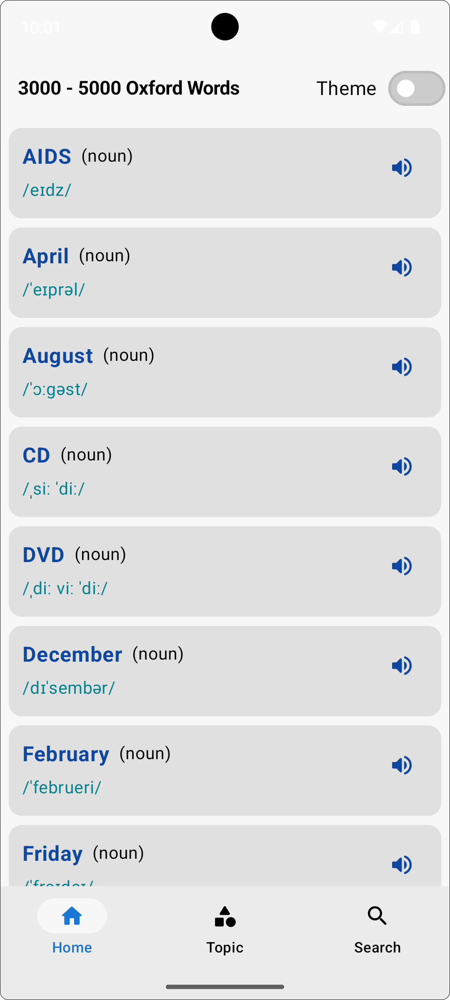
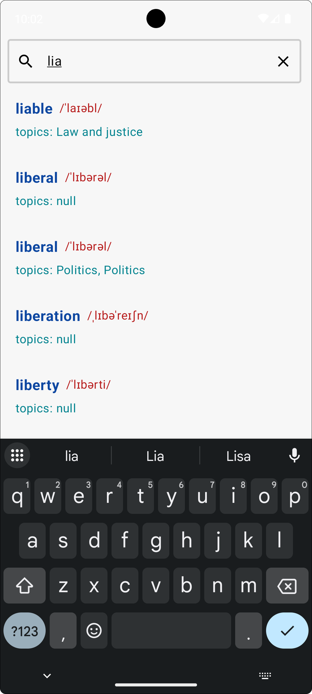
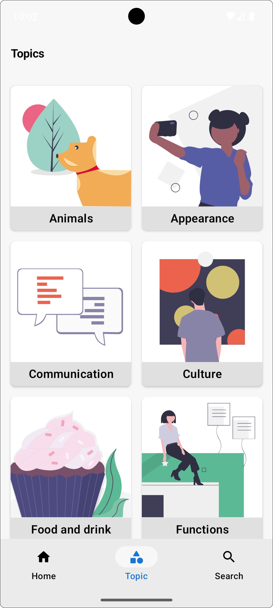
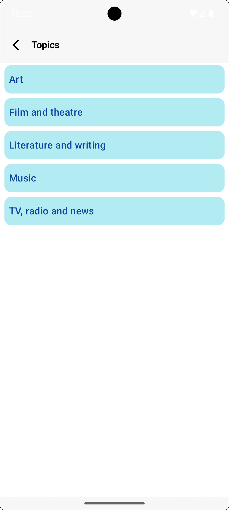
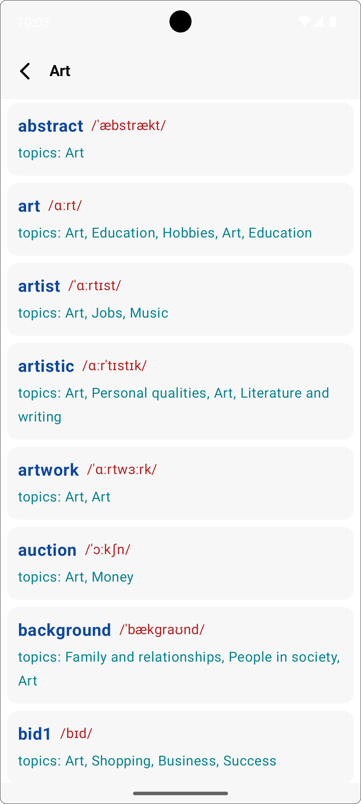
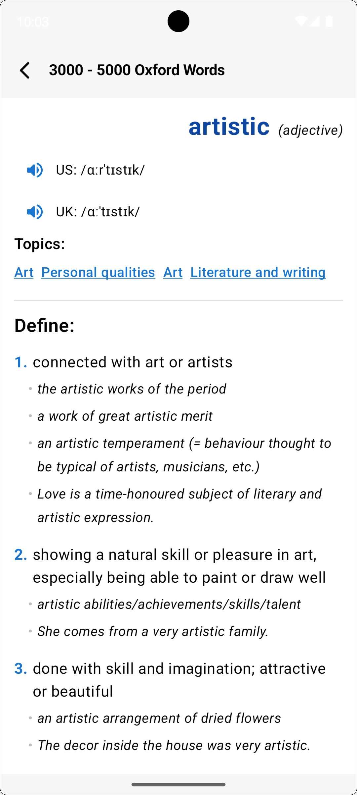
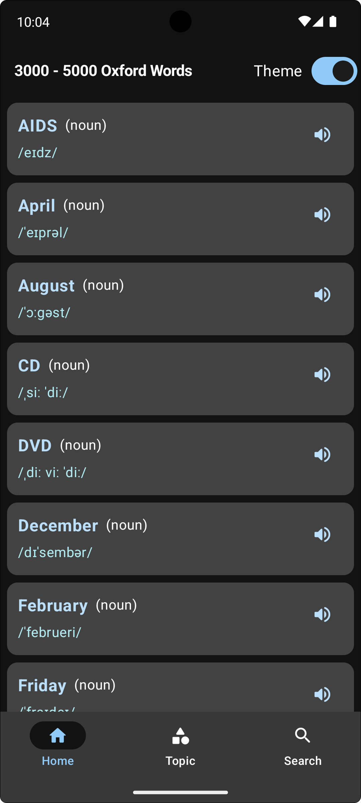
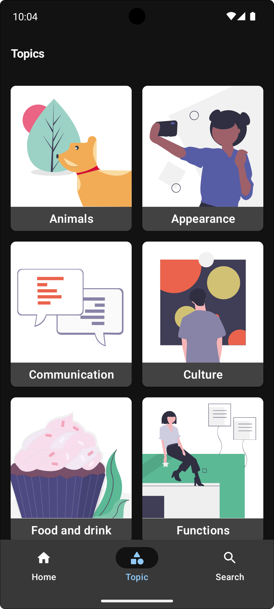
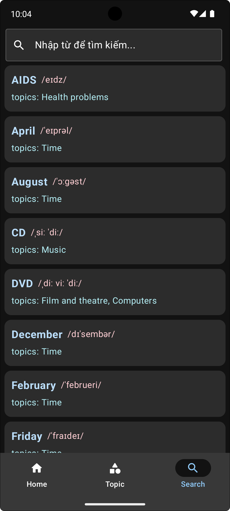

# 3000 từ vựng Oxford

## 📱 Giới thiệu

**3000 từ vựng Oxford** là ứng dụng học từ vựng tiếng Anh dành cho Android, được phát triển bằng **Kotlin Jetpack Compose** trên nền tảng. Ứng dụng tập trung vào việc giúp người dùng xây dựng nền tảng vững chắc với 3000 từ vựng cốt lõi theo chuẩn Oxford đáng tin cậy. Mục tiêu của ứng dụng là mang đến trải nghiệm học tập thân thiện, linh hoạt và hiệu quả nhất. Người dùng có thể chuyển đổi Theme Sáng/Tối để bảo vệ mắt. Hãy tải ứng dụng và bắt đầu hành trình làm chủ từ vựng tiếng Anh một cách chủ động ngay hôm nay!

## 📸 Ảnh chụp giao diện ứng dụng

<table style="width:100%; table-layout:fixed; text-align:center;">
  <tr>
    <td>Trang chủ</td>
    <td>Tìm kiếm</td>
    <td>Tìm kiếm</td>
  </tr>
  <tr>
    <td></td>
    <td></td>
    <td></td>
  </tr>
  <tr>
    <td colspan="3"></td>
  </tr>
  <tr>
    <td>Chủ đề</td>
    <td>Chủ đề chia nhỏ</td>
    <td>Từ vựng theo chủ đề</td>
  </tr>
  <tr>
    <td></td>
    <td></td>
    <td></td>
  </tr>
  <tr>
    <td colspan="3"></td>
  </tr>
  <tr>
    <td>Chế độ nền tối</td>
    <td>Chế độ nền tối</td>
    <td>Chế độ nền tối</td>
  </tr>
  <tr>
    <td></td>
    <td></td>
    <td></td>
  </tr>
  <tr>
    <td colspan="1"></td>
  </tr>
  <tr>
    <td>Chế độ nền tối</td>
  </tr>
  <tr>
    <td></td>
  </tr>
  </table>

## 🔥 Chức năng chính

- Học từ vựng với 3000 từ vựng chuẩn theo Oxford
- Nghe cách đọc
- Học theo chủ đề
- Tìm kiếm từ vựng
- Thay đổi chế độ sáng/tối để phù hợp với ánh sáng xung quanh

## 🛠 Công nghệ sử dụng

### Android Studio

- **Ngôn ngữ**: Kotlin
- **Thư viện chính**: Firebase, exoplayer, Material3, Jetpack Compose

### Database

- Firebase
- Oxford

### Công cụ hỗ trợ

- **Thiết kế UI/UX**: Figma
- **IDE**: Android Studio
- **Version Control**: GitHub

## 🚀 Cài đặt và chạy ứng dụng

### Yêu cầu hệ thống

- Android Studio bản Iguana/Jellyfish/Koala/Ladybug/Narwhal hoặc mới hơn
- Android SDK 24+
- JDK 17+

### Các bước cài đặt

1. Clone repository:
   ```bash
   git clone https://github.com/chaolaolo/EnglishVocabulary.git
   ```
2. Mở project bằng Android Studio
3. Đồng bộ Gradle và tải các dependencies
4. Chạy ứng dụng trên máy ảo hoặc thiết bị thật

**Liên hệ với tôi**:

- Chảo Láo Lở - [chaolaolo290604@gmail.com](mailto:chaolaolo290604@gmail.com).
- Phone: 0396471382
